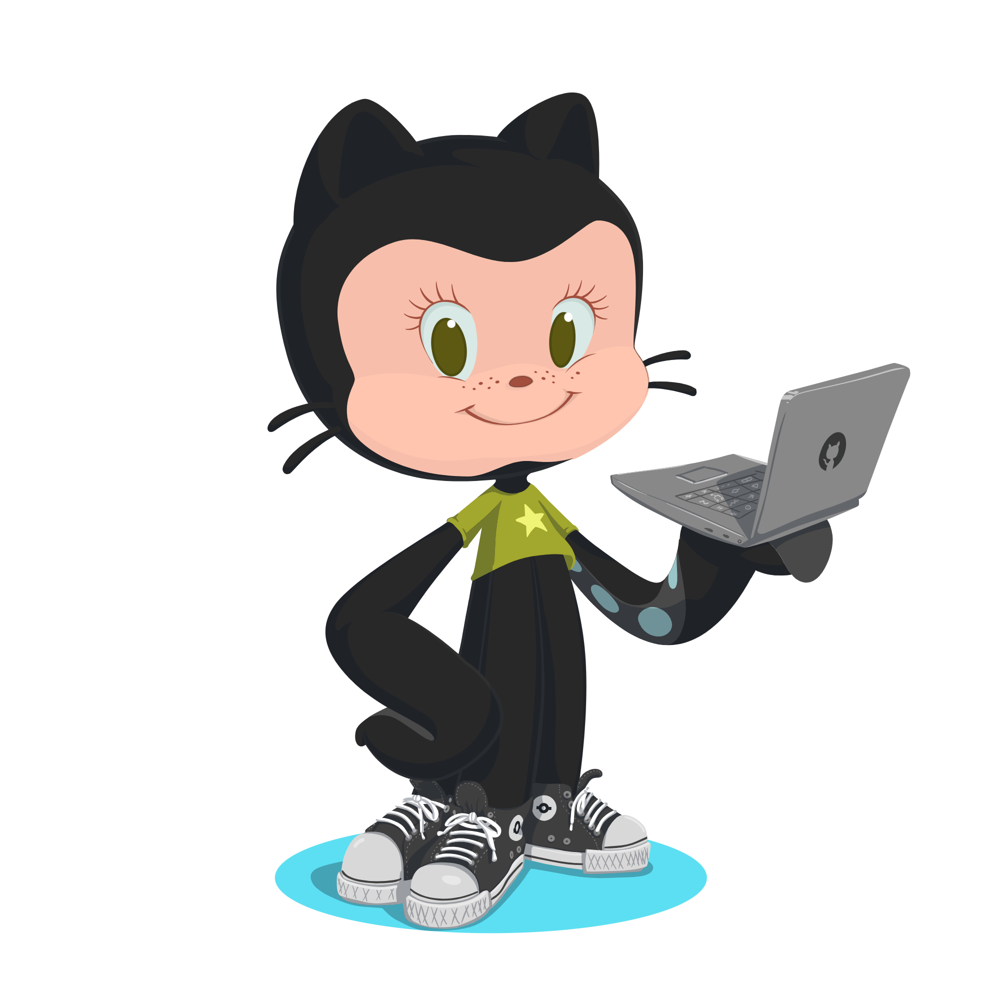

<!--  -->

 <!--   -->

  <H2 style='font'> 💻 Carolina Silva</H2> 

  🎓 **Desenvolvimento de Software Multiplataforma** - Fatec Luigi Papaiz.  

  ### Tecnologias e Habilidades  
- **Linguagens e Frameworks**:  Java, Spring Boot, TypeScript, React, Python.  
- **Machine Learning**: TensorFlow, Keras, redes neurais convolucionais (U-Net).  
- **Banco de Dados**: MongoDB, MySQL.  
- **Ferramentas**: Git, Figma, Google Colab.  

### Projetos Recentes  
- **[Análise de Sentimentos em Feedbacks de Áudio ](https://github.com/Carolina-Silva/sentiment_analysis_PLN)**:Transcrever áudios e realizar análises de sentimentos.  
- **[Bookshifter](https://github.com/Carolina-Silva/bookshifter)**: Aplicativo para doação e recomendação de livros.

###  Atualmente  
- Explorando redes neurais convolucionais e segmentação de imagens científicas.  
-  

### 📫 **Entre em contato**  
  
  
  
 

